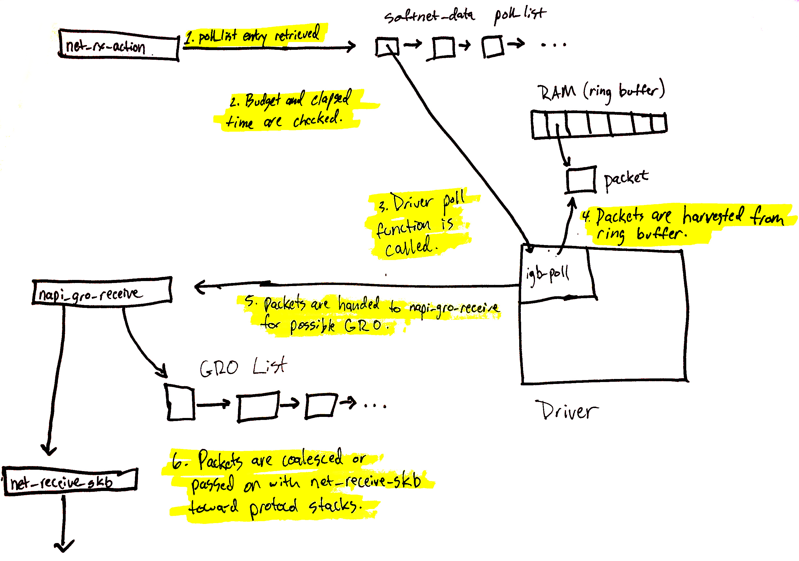

# Linux 如何收包

## softIRQ 初始化

计算机外设与计算机系统协同工作，当外设中有数据需要计算机系统处理时，有多种方式可以通知到计算机系统。网络设备作为一种计算机外设，通常是通过中断（IRQ）来通知计算机系统一个网络数据包已经到达，并且这个网络包已经准备好被处理了。而计算机系统通常通过中断处理函数来响应中断。

基于操作系统，CPU 和中断的运行机制（详见 [MIT6.S081](https://github.com/huihongxiao/MIT6.S081/tree/master/lec09-interrupts)），中断处理函数必须尽可能快的执行并退出。这里有几个原因：首先，中断的优先级更高，中断执行时正常的程序是被挂起的，如果中断时间过长会导致程序被挂起时间过长；其次，当一个中断函数正在执行时，相同的其他中断会被 CPU 忽略，对于网卡来说可能会导致相邻的两个网络包的后一个被丢弃。所以，位于网卡驱动中的中断处理函数必须只执行耗时短的简单指令。

但是另一方面，计算机网络协议又较为复杂，不太可能只通过简单的指令完成处理。所以 Linux 的解决办法是引入 softIRQ 系统。这是Linux kernel 使用的一个用来在设备驱动中断上下文之外处理工作的系统，所以它并不局限与处理网络数据，虽然处理网络数据是它最主要的应用场景。

softIRQ 系统本质上就是一组内核线程（每个 CPU 核对应一个线程），这个线程会根据预先注册的 softIRQ 事件来运行不同的处理函数。如果查看 _top_ 指令，可以看到 _ksoftirqd/0_，这就是运行在 CPU 0 的 softIRQ 内核线程。

Linux网络实现最反直觉的一部分就是softIRQ处理网络数据的过程，下面首先来看一下与网络相关的 softIRQ 的初始化过程。

<figure><figcaption></figcaption></figure>

1. Linux 内核启动的时候，会调用位于kernel/softirq.c 中的 [spawn\_ksoftirqd](https://github.com/torvalds/linux/blob/v5.15/kernel/softirq.c#L958-L973) 函数，为每个 CPU 核都注册一个 softIRQ 内核线程，被注册的线程对象 **smp\_hotplug\_thread** 中有三个信息值得关注：

* 线程名是：ksoftirqd/%u，后面的数字是 CPU 的编号
* 线程的运行函数是：run\_ksoftirqd
* 线程的检查函数是：ksoftirqd\_should\_run，它决定是否该运行 run\_ksoftirqd


```c
static struct smp_hotplug_thread softirq_threads = {
	.store			= &ksoftirqd,
	.thread_should_run	= ksoftirqd_should_run,
	.thread_fn		= run_ksoftirqd,
	.thread_comm		= "ksoftirqd/%u",
};

static __init int spawn_ksoftirqd(void)
{
	cpuhp_setup_state_nocalls(CPUHP_SOFTIRQ_DEAD, "softirq:dead", NULL,
				  takeover_tasklets);
	BUG_ON(smpboot_register_percpu_thread(&softirq_threads));

	return 0;
}
early_initcall(spawn_ksoftirqd);
```


2. 注册完之后，在 [kernel/smpboot.c](https://github.com/torvalds/linux/blob/v5.15/kernel/smpboot.c#L164) 中会循环判断thread\_should\_run，也就是ksoftirqd\_should\_run。如果该函数返回True，则执行注册了的thread\_fn，也就是 [run\_ksoftirqd ](https://github.com/torvalds/linux/blob/v5.15/kernel/softirq.c#L912)函数。至此，Linux的softIRQ线程初始化完毕，但是它还没有与网络数据的处理绑定。

* 而run\_ksoftirqd 函数也只是包装了[\_\_do\_softirq](https://github.com/torvalds/linux/blob/v5.15/kernel/softirq.c#L920) 函数。


```c
static void run_ksoftirqd(unsigned int cpu)
{
	ksoftirqd_run_begin();
	if (local_softirq_pending()) {
		/*
		 * We can safely run softirq on inline stack, as we are not deep
		 * in the task stack here.
		 */
		__do_softirq();
		ksoftirqd_run_end();
		cond_resched();
		return;
	}
	ksoftirqd_run_end();
}
```


3. 在网络设备（即网卡）的初始化过程中，也就是 [net\_dev\_init](https://github.com/torvalds/linux/blob/v5.15/net/core/dev.c#L11600) 函数中，会为每个 CPU 创建一个 [softnet\_data](https://github.com/torvalds/linux/blob/v5.15/include/linux/netdevice.h#L3327) 数据结构，并且初始化 softnet\_data 中的 [poll\_list](https://github.com/torvalds/linux/blob/v5.15/net/core/dev.c#L11636)。poll\_list 是一个重要的数据，里面会存放 NAPI 获取到的，从网卡中轮询（poll）到的packet。NAPI是 Linux 网络处理中的一个重要概念，它的出现与中断的处理方式有关，具体背景可以在 [MIT6.S081](https://mit-public-courses-cn-translatio.gitbook.io/mit6-s081/lec21-networking-robert/21.8-receive-livelock) 中找到。此时，与softIRQ和网络相关的数据初始化完成，但是softIRQ还没有与网络数据的处理绑定。


```c
/*
 * Incoming packets are placed on per-CPU queues
 */
struct softnet_data {
	struct list_head	poll_list;
	struct sk_buff_head	process_queue;
	// ... other attributes
}
```


4. 同样在 [net\_dev\_init ](https://github.com/torvalds/linux/blob/v5.15/net/core/dev.c#L11666)函数中，通过 [open\_softirq ](https://github.com/torvalds/linux/blob/v5.15/kernel/softirq.c#L702)函数将NET\_RX\_SOFTIRQ 注册到 softIRQ 系统中，并绑定处理函数net\_rx\_action。这个函数就是内核的 softIRQ 线程最终用来处理 packet 的函数。这里实际上是告诉softIRQ系统，如果看到了 NET\_RX\_SOFTIRQ 事件，那就调用 net\_rx\_action 函数。那NET\_RX\_SOFTIRQ 事件如何被触发呢？


```c
static int __init net_dev_init(void)
{
	// ...
	open_softirq(NET_TX_SOFTIRQ, net_tx_action);
	open_softirq(NET_RX_SOFTIRQ, net_rx_action);
	// ...
}
```



```c
void open_softirq(int nr, void (*action)(struct softirq_action *))
{
	softirq_vec[nr].action = action;
}
```


5. 位于设备驱动内的中断处理函数会调用 napi\_schedule（下一节详细介绍），经过简单的跳转，来到[\_\_\_\_napi\_schedule](https://github.com/torvalds/linux/blob/v5.15/net/core/dev.c#L4336)，这个函数会将驱动中的 NAPI poll 结构体追加到第 3 步中的每个 CPU 的 softnet\_data 中的 poll\_list。此时，相当于将数据（指针）拷贝到了softIRQ系统。


```c
///* Called with irq disabled */
static inline void ____napi_schedule(struct softnet_data *sd,
				     struct napi_struct *napi)
{
	// ...
	list_add_tail(&napi->poll_list, &sd->poll_list);
	__raise_softirq_irqoff(NET_RX_SOFTIRQ);
}

```


6. 之后，同样在[\_\_\_\_napi\_schedule](https://github.com/torvalds/linux/blob/v5.15/net/core/dev.c#L4337)函数内，会调用[\_\_raise\_softirq\_irqoff](https://github.com/torvalds/linux/blob/v5.15/kernel/softirq.c#L699)，将NET\_RX\_SOFTIRQ对应的 softirq\_pending bit 设置为 1。


```c
void __raise_softirq_irqoff(unsigned int nr)
{
	lockdep_assert_irqs_disabled();
	trace_softirq_raise(nr);
	or_softirq_pending(1UL << nr);
}
```


7. 而在第2步中，softIRQ线程会循环的判断 ksoftirqd\_should\_run，如果返回 True 则执行 run\_ksoftirqd。
8. ksoftirqd\_should\_run 只是简单的判断softirq\_pending bit，如果softirq\_pending bit被设置为 1（第 6 步），那么run\_ksoftirqd函数会被执行，进而执行[\_\_do\_softirq](https://github.com/torvalds/linux/blob/v5.15/kernel/softirq.c#L515)。在该函数内，会根据softirq\_pending被设置的 bit 位，执行之前注册了的处理函数，也就是第 4 步中的net\_rx\_action函数。net\_rx\_action 函数会处理接受网络包的主要工作，而它是被 softirq 内核线程调用，而不是被设备驱动中的中断处理函数调用。


```c
static int ksoftirqd_should_run(unsigned int cpu)
{
	return local_softirq_pending();
}
```



```c
asmlinkage __visible void __softirq_entry __do_softirq(void)
{
	// ...
	h = softirq_vec;
	while ((softirq_bit = ffs(pending))) {
		// ...
		trace_softirq_entry(vec_nr);
		h->action(h);
		trace_softirq_exit(vec_nr);
		// ...
		h++;
		pending >>= softirq_bit;
	}
	// ...
}
```


上面的第5步，中断处理函数会调用napi\_schedule。接下来看看网卡收到包到napi\_schedule被调用之间的过程。

## 网卡中断函数

当一个网络数据包到达网卡时，网卡会使用DMA将网络数据包传输到内存（DMA是一种数据拷贝硬件，拷贝过程不占用CPU时钟且传输效率更高）。内存中用来接收网络数据包的空间由网卡驱动创建，并且会以ringbuffer（顾名思义，环形缓存，或者首尾相连的队列）的形式存在。Ringbuffer中存放的是内存地址，这个内存地址指向了可以用来存储网络数据包的空间。

目前大部分网卡支持多队列，这意味着网卡会创建多个ring buffer，网卡接收到的数据包会被 DMA 送到某个ring buffer指向的内存地址。网卡的多队列通常对应多个CPU核，这样可以让多个CPU并发处理网络数据包以提升效率。不过为了描述简单，我们下面只介绍单个ring buffer的场景。


<figure><figcaption></figcaption></figure>

1. 网卡收到了来自网络中的一个数据包。
2. 网卡使用DMA将网络数据写入到计算机内存。
3. 网卡触发一个中断。
4. 网卡驱动之前注册的对应的中断处理函数被计算机系统执行。下面是一个[igb驱动的中断处理函数](https://github.com/torvalds/linux/blob/v5.15/drivers/net/ethernet/intel/igb/igb\_main.c#L6867-L6877)。可以看到这里与我们前面介绍的一致，中断处理函数很简短。igb\_write\_itr更新了一个硬件寄存器，用来记录硬件中断产生的速率。这个寄存器可以用来限制向CPU产生中断的速度。之后就调用了napi\_schedule函数。


```c
static irqreturn_t igb_msix_ring(int irq, void *data)
{
	struct igb_q_vector *q_vector = data;

	/* Write the ITR value calculated from the previous interrupt. */
	igb_write_itr(q_vector);

	napi_schedule(&q_vector->napi);

	return IRQ_HANDLED;
}
```


5. 网卡的中断被复位，这样后续的网络数据包就能产生新的中断 (第 5 步应该在第 6 步之后？)。
6. 网卡驱动调用napi\_schedule。在上面的[第 5 步](linux-ru-he-shou-bao.md#chu-shi-she-zhi-jie-duan)看到，napi\_schedule 只是将网卡传过来的数据挂到 poll\_list 后，然后设置了NET\_RX\_SOFTIRQ。由于softIRQ 线程一直在运行，当线程循环下次检测到NET\_RX\_SOFTIRQ被置位后，就会执行 net\_rx\_action 函数。

napi\_schedule 的调用过程

1. [include/linux/netdevice.h](https://github.com/torvalds/linux/blob/v5.15/include/linux/netdevice.h#L453)


```c
/**
 *	napi_schedule - schedule NAPI poll
 *	@n: NAPI context
 *
 * Schedule NAPI poll routine to be called if it is not already
 * running.
 */
static inline void napi_schedule(struct napi_struct *n)
{
	if (napi_schedule_prep(n))
		__napi_schedule(n);
}
```


2. [net/core/dev.c](https://github.com/torvalds/linux/blob/v5.15/net/core/dev.c#L6473)


```c
/**
 * __napi_schedule - schedule for receive
 * @n: entry to schedule
 *
 * The entry's receive function will be scheduled to run.
 * Consider using __napi_schedule_irqoff() if hard irqs are masked.
 */
void __napi_schedule(struct napi_struct *n)
{
	unsigned long flags;

	local_irq_save(flags);
	____napi_schedule(this_cpu_ptr(&softnet_data), n);
	local_irq_restore(flags);
}
EXPORT_SYMBOL(__napi_schedule);
```


3. [net/core/dev.c](https://github.com/torvalds/linux/blob/v5.15/net/core/dev.c#L4310)


```c
/* Called with irq disabled */
static inline void ____napi_schedule(struct softnet_data *sd,
				     struct napi_struct *napi)
{
	// ...
	list_add_tail(&napi->poll_list, &sd->poll_list);
	__raise_softirq_irqoff(NET_RX_SOFTIRQ);
}
```



## 软中断处理函数---net-rx-action

<figure><figcaption></figcaption></figure>

